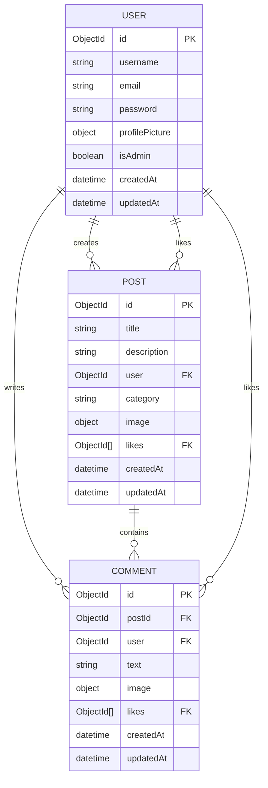

# ✍️ Blog API

A robust, enterprise-grade RESTful API built for modern blogging platforms. Engineered with **Node.js**, **Express.js**, and **MongoDB (using Mongoose)**, the entire application is fully typed in **TypeScript** to ensure security, stability, and speed.

This project implements JSON Web Tokens (JWT) for secure authentication, role-based authorization guards, Joi-based validation, complex data models with relational integrity, dynamic image upload functionality through Cloudinary, and robust nested/hierarchical structure capability.

---

## 🛠️ Tech Stack

<p align="left">
  <a href="https://nodejs.org/">
    
  </a>
  <a href="https://expressjs.com/">
    
  </a>
  <a href="https://www.typescriptlang.org/">
    
  </a>
  <a href="https://www.mongodb.com/">
    
  </a>
  <a href="https://mongoosejs.com/">
    
  </a>
  <a href="https://cloudinary.com/">
    
  </a>
  <a href="https://jwt.io/">
    
  </a>
</p>

- **Runtime Environment:** Node.js (v16+)
- **Framework:** Express.js (v5)
- **Language:** TypeScript (Configured for ESM - ES2022)
- **Database:** MongoDB via Mongoose ODM
- **Validation:** Joi (with Password Complexity rules)
- **Security:** Bcrypt.js, Helmet, CORS
- **Media Uploads:** Multer with Cloudinary API
- **Mail Delivery:** Nodemailer (For forgot/reset password flows)

---

## ✨ Key Features

- 🔐 **Secure User Authentication & Access Control**
  - Registration with automatic OTP code dispatch for email verification.
  - Secure verification step to validate account email addresses using one-time passwords (OTP).
  - User login with auto-generated JWT tokens.
  - Bulletproof password hashing using `bcryptjs` with 10 salt rounds.
  - Complete password reset request pipeline using signed tokens and email delivery (`nodemailer`).
  - Hierarchical authorization middlewares (`verifyToken`, `verifyAuthorizedToken`, `verifyAdminToken`).
- 📝 **Advanced Post Management**
  - Full CRUD capabilities for creating, reading, updating, and deleting posts.
  - Dynamic image uploads (thumbnail/cover) to Cloudinary via Express middleware using `multer`.
  - Social interactions: Post like/unlike toggling with user tracker associations.
- 💬 **Flexible Commenting & Feedback System**
  - Embedded commenting functionality linked dynamically to posts.
  - Media support for comments with dedicated Cloudinary image uploads.
  - Social interactions: Comment like/unlike tracking.
- 🛡️ **Data Integrity & Validation**
  - Strict input sanitation and schema constraints using Joi.
  - Real-time validation for requests (body parameters, credentials, structure).
- 🚀 **RESTful Design Patterns**
  - Logical API response formats returning consistent, pure JSON structures.
  - Global middleware-based error handling & 404 handler.
  - TypeScript-safe request and response payload typing.

---

## 📊 Database Entity-Relationship (ER) Diagram

The diagram below outlines the schema relations and virtual links of the database:



---

## 📂 Project Architecture

```text
blog-api/
├── src/
│   ├── config/             # Database connection setups
│   │   └── db.ts
│   ├── controllers/        # Request handlers & controller logic
│   │   ├── authController.ts
│   │   ├── commentController.ts
│   │   ├── postController.ts
│   │   └── userController.ts
│   ├── middlewares/        # Custom middlewares (Auth, Upload, Errors)
│   │   ├── errors.ts       # Global error processing
│   │   ├── multer.ts       # File upload middleware using disk storage
│   │   └── verifyToken.ts  # Route guards for token & owner validation
│   ├── models/             # Mongoose Schemas & Joi validators
│   │   ├── Comment.ts
│   │   ├── Post.ts
│   │   └── User.ts
│   ├── routers/            # Router endpoints definition
│   │   ├── auth.ts
│   │   ├── comments.ts
│   │   ├── posts.ts
│   │   └── users.ts
│   ├── types/              # Custom express request global typings
│   ├── utils/              # Third-party configuration helpers
│   │   └── cloudinary.ts   # Cloudinary Client integration
│   ├── app.ts              # Entrypoint file starting the Server
│   ├── data.ts             # Mock seed data structures
│   └── seeder.ts           # Seeding script for bulk updates
├── dist/                   # Transpiled build output
├── tsconfig.json           # Compiler rules
├── package.json            # Scripts & packages manager
└── .env.example            # Environment template configuration
```

---

## 🚀 Getting Started

Follow these steps to run the project locally.

### Prerequisites

Ensure you have the following installed on your local machine:
- **Node.js** (v16.0.0 or higher)
- **MongoDB** (Local Community Server or MongoDB Atlas instance)

### Installation

1. **Clone the Repository:**
   ```bash
   git clone <repository-url>
   cd "Blog API"
   ```

2. **Install Dependencies:**
   ```bash
   npm install
   ```

3. **Configure Environment Variables:**
   Create a `.env` file in the root directory by duplicating the template:
   ```bash
   cp .env.example .env
   ```
   Open the `.env` file and populate it with your specific database connections and API credentials (see [Environment Variables](#-environment-variables)).

### Running the Application

- **Development Mode (Hot Reloading via `tsx`):**
  ```bash
  npm run dev
  ```
  The server starts at `http://localhost:5000` by default.

- **Build Output (Transpile TypeScript to JavaScript):**
  ```bash
  npm run build
  ```

- **Production Mode (Running Compiled JS):**
  ```bash
  node dist/app.js
  ```

- **Database Seeding Operations:**
  ```bash
  # Import mock posts into the database
  npx tsx src/seeder.ts -import

  # Delete all posts from the database
  npx tsx src/seeder.ts -destroy
  ```

---

## 🔑 Environment Variables

The project requires several keys for full functionality. A reference is provided in [.env.example](file:///.env.example).

| Variable Name | Description | Example / Default Value |
| :--- | :--- | :--- |
| `PORT` | Local server port | `5000` |
| `MONGO_URI` | Connection string for MongoDB | `mongodb://localhost:27017/blog` |
| `JWT_SECRET_KEY` | Secret key used to sign & verify user tokens | `super_secret_cryptographic_key_here` |
| `USER_EMAIL` | Nodemailer sender email account | `example.user@gmail.com` |
| `USER_PASS` | App password from email provider (e.g. Gmail) | `xxxx xxxx xxxx xxxx` |
| `CLOUD_NAME` | Cloudinary integration: Cloud Name | `your_cloudinary_cloud_name` |
| `API_KEY` | Cloudinary integration: API Key | `your_cloudinary_api_key` |
| `API_SECRET` | Cloudinary integration: API Secret | `your_cloudinary_api_secret` |

---

## 📡 API Endpoints Summary

All routes are mounted directly on their respective categories without extra prefixes (e.g. `/auth/login`).

### Auth Router (`/auth`)
| Method | Endpoint | Authorization | Description |
| :--- | :--- | :--- | :--- |
| `POST` | `/auth/register` | Public | Registers a new User. |
| `POST` | `/auth/login` | Public | Logs in a User and returns a JWT token. |
| `POST` | `/auth/verify-otp` | Public | Verifies user's email address using OTP code. |
| `POST` | `/auth/forgot-password` | Public | Sends a secure password reset link to user's email. |
| `POST` | `/auth/reset-password/:userId/:token` | Public | Validates token and resets user password. |

### Users Router (`/users`)
| Method | Endpoint | Authorization | Description |
| :--- | :--- | :--- | :--- |
| `GET` | `/users` | Login Required (`verifyToken`) | Retrieves all users list. |
| `GET` | `/users/:id` | Login Required (`verifyToken`) | Retrieves details of a single user by ID. |
| `PUT` | `/users/:id` | Owner / Admin (`verifyAuthorizedToken`) | Updates account details. |
| `POST` | `/users/:id/upload` | Owner / Admin + Multer | Uploads and updates profile picture. |
| `DELETE` | `/users/:id` | Admin Only (`verifyAdminToken`) | Deletes user from DB. |

### Posts Router (`/posts`)
| Method | Endpoint | Authorization | Description |
| :--- | :--- | :--- | :--- |
| `GET` | `/posts` | Login Required (`verifyToken`) | Returns all posts (populates virtual comments). |
| `POST` | `/posts` | Login Required (`verifyToken`) | Creates a new blog post. |
| `GET` | `/posts/:id` | Login Required (`verifyToken`) | Retrieves a single post. |
| `PUT` | `/posts/:id` | Post Owner / Admin (`verifyPostOwner`) | Updates post parameters. |
| `DELETE` | `/posts/:id` | Post Owner / Admin (`verifyPostOwner`) | Deletes post & clears media assets. |
| `PUT` | `/posts/:id/like` | Login Required (`verifyToken`) | Toggles like/unlike on a post. |
| `POST` | `/posts/upload` | Login Required (`verifyToken`) + Multer | Uploads thumbnail media to Cloudinary. |

### Comments Router (`/posts/:postId/comments`)
*Mounted as a nested sub-router under Posts for structural integrity.*
| Method | Endpoint | Authorization | Description |
| :--- | :--- | :--- | :--- |
| `GET` | `/` | Login Required (`verifyToken`) | List all comments linked to this post. |
| `POST` | `/` | Login Required (`verifyToken`) | Create a comment under the post. |
| `PUT` | `/:commentId` | Comment Owner / Admin (`verifyCommentOwner`) | Update text content of a comment. |
| `DELETE` | `/:commentId` | Comment Owner / Admin (`verifyCommentOwner`) | Delete a comment. |
| `PUT` | `/:commentId/like` | Login Required (`verifyToken`) | Toggle like/unlike on comment. |
| `POST` | `/:commentId/upload` | Comment Owner / Admin + Multer | Upload comment image to Cloudinary. |

---

## 🛡️ Security & Validation Principles

1. **Joi Schema Guards:** Before reaching database interfaces, all user inputs (Registration, Logins, Profile Updates, Post/Comment creations) are strictly parsed and checked using Joi schemas.
2. **Resource Ownership Guards:** Specific CRUD actions verify if the requesting User matches the actual owner of the database records (e.g. `verifyPostOwner` or `verifyCommentOwner`). Admin flags bypass ownership checks, allowing moderate privilege.
3. **Helmet Header Protection:** Implemented `helmet()` middleware to automatically set HTTP headers safeguarding against clickjacking, sniff attacks, cross-site scripting (XSS), etc.
4. **CORS Configuration:** Fully controlled Cross-Origin Resource Sharing settings (allows requests from specified domains e.g., local client dashboard).

---

## 🤝 Contributing

Contributions are welcome! If you find any bugs or have feature recommendations, please feel free to open an Issue or submit a Pull Request:
1. Fork the project.
2. Create your Feature Branch (`git checkout -b feature/AmazingFeature`).
3. Commit your changes (`git commit -m 'Add some AmazingFeature'`).
4. Push to the Branch (`git push origin feature/AmazingFeature`).
5. Open a Pull Request.

---

## 📄 License

Distributed under the **ISC License**. See `LICENSE` or details in the package configuration for more information.

